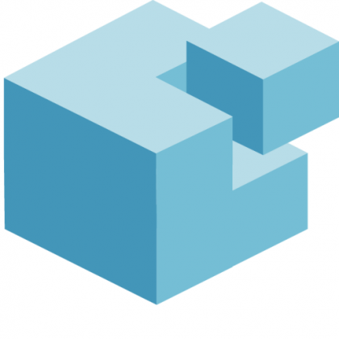
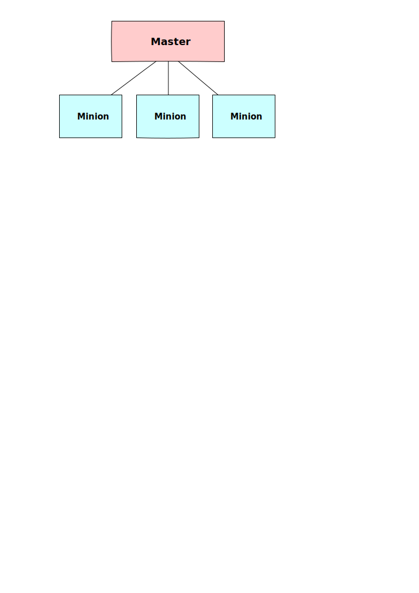
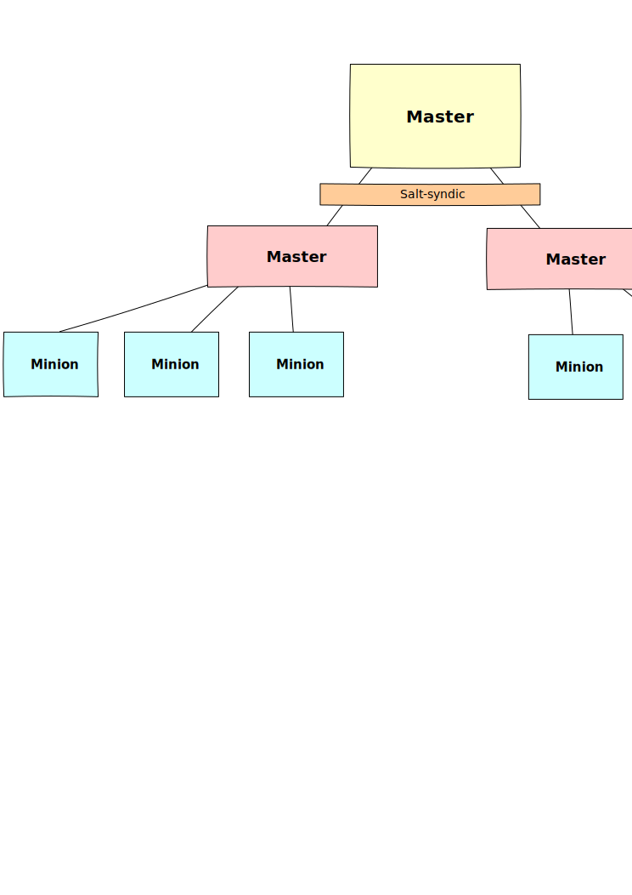
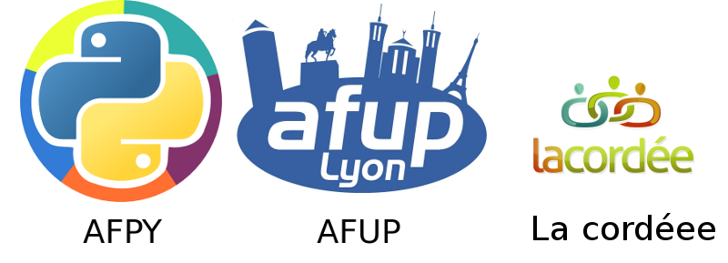

.. Gérer son infra avec Salt documentation master file, created by
   sphinx-quickstart on Tue Feb 26 10:31:01 2013.
   You can adapt this file completely to your liking, but it should at least
   contain the root `toctree` directive.

Saltstack
=========

Gaston TJEBBES

tech@majerti.fr

Le contexte
===========

* L'hébergement de solutions développées en interne
* Le réseau interne d'une entreprise

Le besoin
==========

* Gain de temps
* Gestion des problématiques de sécurité
* Automatisation du workflow
* Uniformiser les configurations
* Anticiper la croissance

Autrement dit
=============

* Lancer des commandes de manière unifiée
* Centraliser des configurations éparses
* Gérer des dépendances (logiciels, fonctionnels)
* Cibler des machines

Pourquoi Saltstack
==================

* Libre
* Python
* Une architecture simple
* Un système de ciblage avancé (grains + pillar)
* Des fonctionnalités qui matchent nos besoins et nos ambitions
  (salt-virt, reactor, salt-mine ...)

Le projet
=========

* Projet initié en 2011 par Thomas S Hatch
* Licence Apache 2.0
* Une ML très active
* Près d'un millier de contributeurs
* Porté par une entreprise du même nom

Les composants
==============

* Protocole : ZeroMQ ou RAET
* Format : MsgPack + AES
* Authentification : clés RSA

Disponibilité
==============

* BSD
* Linux
* Windows
* Osx
* ...

Architecture
=============

Trois niveaux de complexité:

* Appel local par le biais de salt-call
* Un master et des minions
* salt-syndic, l'architecture à plusieurs étages

Un master des minions
======================

Salt-syndic
===========

Commencer
=========

Installer un "master"

.. code-block:: console

    yum install salt-master

Installer des "minion"

.. code-block:: console

    yum install salt-minion

Référencer

.. code-block:: console

    salt-key -a minion.example.com

On peut désormais jouer
=======================

Les **modules** fournissent un panel de commandes exécutables

.. code-block:: bash

    salt '*' test.ping
    salt 'minion.example.com' pkg.upgrade

Modules
========

* De nombreuses librairies (mount, pkg, rabbitmq, ...)
* Des modules "méta" ( ex: pkg )
* Développables facilement

.. code-block:: python

    #/srv/salt/_modules/hello.py
    def message(filepath, message):
        with open(filepath, w) as file_buffer:
            file_buffer.write(message)

.. code-block:: console

    salt 'minion.example.com' hello.message /tmp/test "Hello world"

Bien viser, le rôle des grains (1)
===================================

Les minions fournissent par défaut des variables d'environnement les 'grains' :

* Fournissent des informations :
    * Matériel
    * Logiciel
* Sont personnalisables
* Permettent de cibler les minion

Bien viser, le rôle des grains (2)
===================================

.. code-block:: python

    salt 'minion.example.com' grains.get os
    minion.example.com
    ------------------
    Fedora

.. code-block:: python

    salt 'minion.example.com' grains.set node_type django
    salt 'minion.example.com' grains.set role prod

Bien viser, le rôle des grains (2)
===================================

.. code-block:: python

    salt -C 'G@node_type:django and G@role:prod' service.status nginx

.. code-block:: python

    salt -G "node_type:django" ssh.set_auth_key john \
    "AAAAB3NzaC1yc2EAAAADAQABAAABAQDiG087JF.." enc="ssh-rsa" \
    comment="john's key"

Configuration : Les états
===========================

* Les fichiers d'état sont des templates jinja ayant pour destination le format
  yaml
* Ils sont stockés par défaut dans /srv/salt
* Un état correspond à une exigence : "Installer le paquet nginx"
* Il peut dépendre d'autre état : "Nginx doit être lancé" requiert "Installation
  du paquet Nginx"

Exemple d'état avec utilisation de grain
============================================

.. code-block:: yaml

    # /srv/salt/nginx.sls
    
    nginx:
        pkg.installed:
            - nginx
        service.runing:
            - name: nginx
            - require:
              - pkg: nginx
    

.. code-block:: yaml

    salt 'minion.example.com' state.sls nginx

top.sls + highstate : le point d'entrée
========================================

**top.sls**

    le fichier d'entrée qui associe les états aux machines

.. code-block:: yaml

    # /srv/salt/top.sls
    base:
        'minion.example.com':
            - django_project
            - nginx

Ce qui va nous permettre de lancer

.. code-block:: console

    salt '*' state.highstate

Gestion des dépendances : require
==================================

**require** permet de requérir :

* Un état
* Un fichier d'état

.. code-block:: yaml

    include:
        - nginx

    collect_static:
        cmd.run:
            - name: /root/collect_static.sh
            - require:
              - sls: nginx

Gestion des dépendances : watch
================================

Observe les modifications apportées par un autre état

.. code-block:: yaml

    gunicorn_conf_file:
        file.managed:
            - source: salt://django/source/etc/gunicorn.d/project.conf
            - name: /etc/gunicorn.d/project.conf

    gunicorn:
      service.running:
        - enable: True
        - reload: True
        - watch:
          - file: gunicorn_conf_file

Le fileserver
===============

* Un serveur de fichier en ZeroMQ intégré au service salt-master
* Permet de fournir des fichiers au gestionnaire d'états
* Les fichiers sont des templates
* Par défaut, les fichiers sont placés dans la même arborescence que les états

.. code-block:: yaml

    gunicorn_conf_file:
        file.managed:
            - source: salt://django/source/etc/gunicorn.d/project.conf
            - name: /etc/gunicorn.d/project.conf
            - template: jinja

Pillar : des variables de configuration
========================================

Composant permettant de distribuer des variables de configuration :

* Stockées sur le master
* Associées aux minions par le biais des grains
* Cloisonnées
* Utilisables dans les states

Pillar : exemple
=================

.. code-block:: yaml

    #/srv/pillar/top.sls
    base:
        'minion.example.com':
            - db_pass

    #/srv/pillar/db_pass.sls
    sql_user: django
    sql_password: ma donnéessuper secret

.. code-block:: jinja

    # /srv/salt/django_project/sources/etc/django/settings.py
    DATABASES = {
            ...
            'USER': '{{ pillar['sql_user'] }}',
            'PASSWORD': '{{ pillar['sql_password'] }}',

Mutualisation des states
====================================

Par défaut les fichiers d'état sont placés dans le répertoire /srv/salt, mais il
est possible :

* D'utiliser des répertoires distants (ex : git)
* D'utiliser plusieurs sources

Ce qui permet d'avoir des dépôts de states génériques.

Salt-formulas
==============

Des repository git génériques alimentés par la communauté.

Dans /etc/salt/master

.. code-block:: python

    fileserver_backend:
        - roots
        - git

    gitfs_remotes:
      - https://github.com/saltstack-formulas/nginx-formula
      - https://github.com/saltstack-formulas/memcached-formula

En configurant nos données pillar, on dispose de states avancés pour installer
memcached et nginx.

La suite (1)
============

**outputers**

    Le format des données renvoyées par les states

**returners**

    La destination des données renvoyées (base de données, mail, irc ...)

L'orchestration : reactor et mine
==================================

**salt-mine**

    permet d'autoriser les minions à communiquer entre eux

**salt-reactor**

    permet, sur la base des events renvoyés, de spécifier des
    callbacks (ex : ajouter une machine au serveur de monitoring lorsqu'un nouveau
    serveur a été initialisé).

Cloud : salt-cloud et salt-virt
================================

**salt-cloud**

    propose une interface pour les différentes solutions de cloud IAAS (Aws, rackspace,
    openstack ...)

**salt-virt**

    permet de manipuler de manière unifier et transparente un ensemble
    d'hyperviseur kvm

Retour (1)
==============

* Nette simplification permettant une orientation vers les problématiques
  métiers.
* Des fonctionnalités qui nous ont permis de développer des outils pertinents.

Retour (2)
============

* Des régressions et des problèmes pénibles (gestion des mises à jour, state qui
  ne fonctionnent plus)
* Une base de code et un cycle d'intégration des patchs upstream "légers"

À noter : une nette progression appréciable

Questions
=========

Le lien vers la conf

    https://github.com/majerteam/salt-slides

Merci
======

